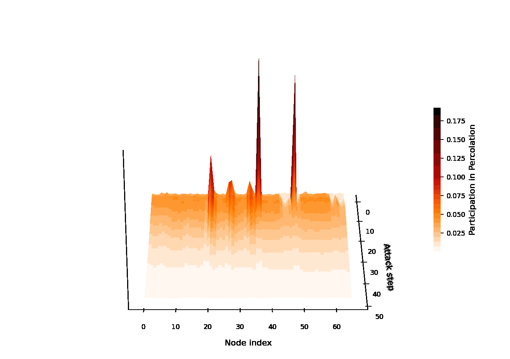

# NetPiP — Participation in Percolation

<p align="center">
  
  <br>
  <em>Group-average PiP surface (n = 19) of expressive language network.</em>
</p>

> **A data-driven measure of network hubs based on Monte Carlo node-removal attacks and percolation-based collapse analysis.**

Minarose Ismail¹,², Brady J. Williamson³, Hansel M. Greiner⁴, Darren S. Kadis¹,²

¹ Department of Physiology, University of Toronto  
² Neurosciences and Mental Health, Hospital for Sick Children, Toronto  
³ University of Cincinnati College of Medicine, Department of Radiology  
⁴ Department of Pediatrics, College of Medicine, University of Cincinnati

---

This repository contains everything needed to reproduce the manuscript *"Participation in Percolation (PiP): A Probabilistic Attack-Based Hub Metric"* (Ismail et al., 202x) **and** a reusable Python / MATLAB toolbox so anyone can apply PiP to their own networks.

## Repository layout

```
NetPiP/
├── netpip/             # pip-installable Python toolbox (validate, run_pip, ranking, clustering, metrics)
├── matlab/             # MATLAB toolbox
├── scripts/            # Paper-reproduction scripts, numbered 1_ .. 6_ in pipeline order
│   ├── 1_*.{py,m}      # Build binary matrices from PSI inputs
│   ├── 2_*.m           # PiP convergence engine (HPC-aware)
│   ├── 3_*.py          # PiP surfaces / weighted matrix plots
│   ├── 4_*.py          # Cluster PiP trajectories -> hub set
│   ├── 5_*.m           # Degree/Betweenness/PageRank benchmarks (BCT)
│   ├── 6_*.{py,m}      # Jaccard + overlap analysis, BrainNet renders
│   ├── helpers/        # Shared utilities + standalone validations
│   └── slurm/          # Slurm job wrappers, same 1_..6_ numbering
├── data/               # Inputs (start point = binary matrices)
├── results/            # Convergence outputs, cluster CSVs, overlap CSVs/figures
├── figures/            # Paper figures (PiP surfaces, cluster, PSI matrices, FigS1)
├── REPRODUCING.md      # End-to-end reproduction guide
├── LICENSE             # MIT
└── CITATION.cff        # Citation metadata
```

There are two ways to use this repository:

| You want to ... | Read |
|---|---|
| Apply PiP to your own binary adjacency matrices (no MEG data required) | [`netpip/README.md`](netpip/README.md) for Python, [`matlab/README.md`](matlab/README.md) for MATLAB |
| Reproduce the manuscript figures | [`REPRODUCING.md`](REPRODUCING.md) and the numbered scripts under `scripts/` |

## The reproduction pipeline at a glance

The numbered scripts in `scripts/` follow exactly the order used in the paper:

| Step | Script(s) | What it does |
|------|-----------|--------------|
| **1** | `1_make_giant75_per_subject.py`, `1_make_giant75_avg.py`, `1_threshold_giant75.m` | Threshold per-subject PSI matrices at 75 % giant-component density; build the cohort-average graph |
| **2** | `2_pip_converge.m` | Run the PiP Monte Carlo engine (Wilson 95 % plateau convergence) and save `node_P` |
| **3** | `3_plot_pip_surfaces.py` | Plot 2D / 3D PiP surfaces (the "weighted matrix" view) |
| **4** | `4_cluster_pip_set.py`, `4_consensus_cluster_per_subject.py` | Ward + silhouette clustering on tilted trajectories → identify PiP hub set |
| **5** | `5_graph_theory_avg.m`, `5_graph_theory_per_subject.m` | Degree / Betweenness / PageRank percolation-point benchmarks (BCT) |
| **6** | `6_export_pip_order.py`, `6_jaccard_overlap.py`, `6_render_brainnet_overlap.m` | Export PiP order, compute Jaccard / Venn overlaps, render BrainNet cortical figures |

Each Slurm wrapper in `scripts/slurm/` uses the same number prefix (`2_pip_converge_avg.sh`, `3_plot_pip_surfaces.sh`, …).

## Quickstart (toolbox)

### Python
```bash
pip install -e netpip[networkx]
python netpip/examples/quickstart.py
```

```python
import numpy as np
from netpip import validate_adjacency, run_pip, pip_top_n_at_percolation_point

A = ...  # your binary, symmetric, 0-diagonal adjacency
validate_adjacency(A, min_giant_fraction=0.75)
res = run_pip(A, max_attacks=1_000_000, chunk_size=10_000, seed=42)
hub_nodes = pip_top_n_at_percolation_point(A, res.node_P)
```

### MATLAB
```matlab
addpath('matlab');
A = double(your_binary_symmetric_adjacency);
netpip.validate_adjacency(A, 'MinGiantFraction', 0.75);

res = netpip.run_pip(A, 'MaxAttacks', 1e6, 'ChunkSize', 1e4, 'Seed', 42);
[order, ~, ~] = netpip.tilted_peak_rank(res.node_P);
pp  = netpip.percolation_point(A, order);
hub = order(1:pp);
```


---

## Citation

Coming soon...

## License

MIT — see [`LICENSE`](LICENSE).
